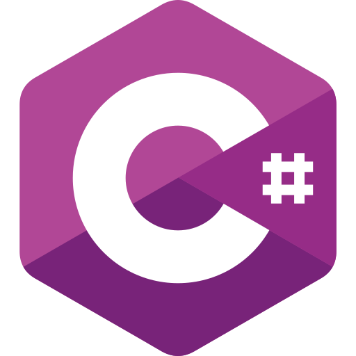

<!---
D-Naveenz/D-Naveenz is a ✨ special ✨ repository because its `README.md` (this file) appears on your GitHub profile.
You can click the Preview link to take a look at your changes.
--->

#  Hello Fellow `<Developers />` !

Hi! My name is Naveen. Thank You for taking the time to view my GitHub Profile :smile:

## About Me 
 

- 🔭 &nbsp;I’m a software engineer and undergraduate at UCSC
- 🌱 &nbsp;I’m currently learning data engineering and cloud tecnolofies
- 👯 &nbsp;I’m looking to collaborate on Game Development and Modding projects
- 💬 &nbsp;Ask me about C#, Python, SQL, JavaScript, and Unity

 

### My Status

&nbsp;&nbsp;

 

## Skills 

### Languages

 &nbsp;&nbsp;&nbsp;  &nbsp;&nbsp;&nbsp;  &nbsp;&nbsp;&nbsp;  &nbsp;&nbsp;&nbsp; 

### Frameworks

![DotNet][dotnet-sheild] ![Unity][unity-sheild] ![Spark][spark-sheild] ![Pandas][pandas-sheild] ![Vue.js][vuejs-sheild] ![Unreal][unreal-sheild]

### Databases

![PostgreSQL][postgresql-sheild] ![MySQL][mysql-shield]

 

<!--  -->

 

## Connect with me 

[![LinkedIn][linkedin-shield]][linkedin-url] [![Medium][medium-shield]][medium-url] [![X][x-shield]][x-url]

-----
Last Edited on: 08/13/2024

<!-- https://www.markdownguide.org/basic-syntax/#reference-style-links -->
<!-- References - Status -->
[visitors-shield]: https://komarev.com/ghpvc/?username=D-Naveenz&style=for-the-badge
[visitors-url]: https://visitorbadge.io/status?path=https%3A%2F%2Fgithub.com%2FD-Naveenz
[follow-sheild]: https://img.shields.io/github/followers/D-Naveenz?label=Follow&style=social
[follow-url]: #

<!-- References - Social Media -->
[linkedin-shield]: https://img.shields.io/badge/Linkedin-%230077B5.svg?style=for-the-badge&logo=linkedin&logoColor=white
[linkedin-url]: https://www.linkedin.com/in/dasheewd/
[medium-shield]: https://img.shields.io/badge/Medium-%23000000.svg?style=for-the-badge&logo=medium&logoColor=white
[medium-url]: https://medium.com/@dasheewd
[x-shield]: https://img.shields.io/badge/X-%23000000.svg?style=for-the-badge&logo=X&logoColor=white
[x-url]: https://x.com/dharmathunga

<!-- References - Frameworks -->
[dotnet-sheild]: https://img.shields.io/badge/.NET-%23512BD4?style=for-the-badge&logo=dotnet&logoColor=white
[unity-sheild]: https://img.shields.io/badge/Unity-%23E9ECEF?style=for-the-badge&logo=unity&logoColor=black
[spark-sheild]: https://img.shields.io/badge/Apache_Spark-%23E25A1C?style=for-the-badge&logo=apachespark&logoColor=white
[pandas-sheild]: https://img.shields.io/badge/Pandas-%23150458?style=for-the-badge&logo=pandas&logoColor=white
[vuejs-sheild]: https://img.shields.io/badge/Vue.js-%234FC08D?style=for-the-badge&logo=vuedotjs&logoColor=white
[unreal-sheild]: https://img.shields.io/badge/Unreal-%230E1128?style=for-the-badge&logo=unrealengine&logoColor=white

<!-- References - Databases -->
[postgresql-sheild]: https://img.shields.io/badge/PostgreSQL-%234169E1?style=for-the-badge&logo=postgresql&logoColor=white
[mysql-shield]: https://img.shields.io/badge/MySQL-%234479A1?style=for-the-badge&logo=mysql&logoColor=white